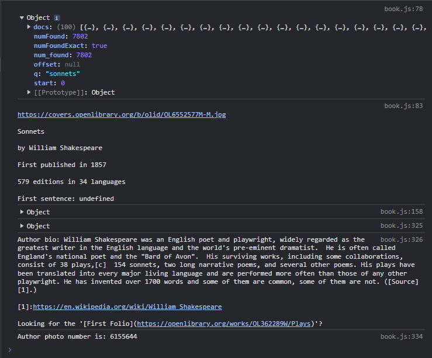
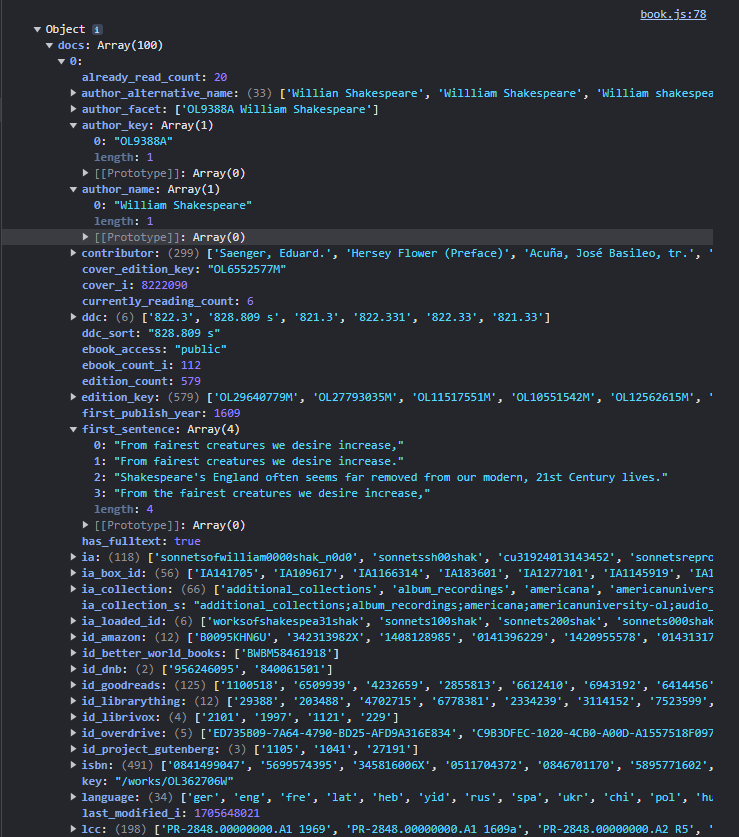

# Blog-API

## OpenLibrary-API application created by codexdev

## Description

### Book-API is Client-side JavaScript web API and online book search data handling system. It is developed mostly by combining `HTML` and `CSS` for rendering with support of `JavaScript` as a functional booster of the application.

## API

### Open Library API for Developers accessing URL parameters

```javascript

/* ***************************************************************************************** */
/* JavaScript CODE ************************************************************************* */
/* ***************************************************************************************** */
//Book name search
//`https://openlibrary.org/search.json?q=${bookName}&fields=*,availability&limit=1` OR
//`https://openlibrary.org/search.json?q=${bookName}&mode=everything`

//Author ${author_key}
//`https://openlibrary.org/authors/${author_key}.json`
//`https://openlibrary.org/authors/OL22242A.json`

//Author photos
//`https://covers.openlibrary.org/a/id/6377428-M.jpg`

//Authors work ${author_key}
//https://openlibrary.org/authors/${author_key}/works.json
//https://openlibrary.org/authors/OL22242A/works.json

//National Literature ${subject_key[num]}
//`https://openlibrary.org/subjects/classic_literature.json`
//`https://openlibrary.org/subjects/russian_literature.json`
//`https://openlibrary.org/subjects/english_literature.json`

//Cover API ${cover_edition_key}
//`https://covers.openlibrary.org/b/olid/${cover_edition_key}-S.jpg`
//`https://covers.openlibrary.org/b/olid/OL22856696M-M.jpg`
/* ***************************************************************************************** */

```

### Console output at Inspect DevTools panel
[](./screenshots/console-output-api-call-open-library.PNG)

### *Continuing ...*
[](./screenshots/objects-and-array-api-data.PNG)


### Peace of a testing code from the application in `JavaScript`
```javascript

//----------------------------------------------
const testGetBookDetails = async function(bookName) {
	bookName = bookName.toString().split(" ").join("%20");
	const bookURL = `https://openlibrary.org/search.json?q=${bookName}&mode=everything`;
	await fetch(bookURL).then(async function(response) {
		if(response.ok) {
			await response.json().then(function(bookData) {
				console.log(bookData);
				//getAuthor(`${bookData.docs[0].author_key[0]}`);
//----------------------------------------------				
//-----------Testing console output-------------
//----------------------------------------------
console.log(`
https://covers.openlibrary.org/b/olid/${bookData.docs[0].cover_edition_key}-M.jpg\n
${bookData.docs[0].title}\n
by ${bookData.docs[0].author_name[0]}\n
First published in ${bookData.docs[0].publish_year[0]}\n
${bookData.docs[0].edition_count} editions in ${bookData.docs[0].language.length} languages\n
First sentence: ${bookData.docs[0].first_sentence[10]}`);
//----------------------------------------------
			});
		}
	});
}
testGetBookDetails("sonnets");
//----------------------------------------------

```

## 📚[API Reference](https://openlibrary.org/dev/docs/api/search)

## GitHub Repo and Deployment

Repository over GitHub account you can find [GitHub Repos][1] and application deployment at [GitHub Pages][2].

[1]: https://github.com/strahinjapopovic/book-api        "GitHub Repos"
[2]: https://strahinjapopovic.github.io/book-api/        "GitHub Pages"

## License

Please refer to the MIT LICENSE in the repo.
